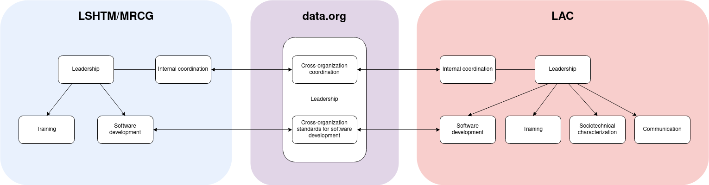

# Governance document for Epiverse-TRACE

## Acronyms

- TRACE: Tools for Response, Analytics, and Control of Epidemics
- LSHTM: London School of Hygiene and Tropical Medicine 
- MRCG: Medical Research Council Unit, The Gambia
- LAC: Latin America and the Caribbean

## Team Structure and Roles

The Epiverse-TRACE GitHub organization contains 3 teams, representing the 3 partner organizations currently involved as equals in the project:

- data.org
- LSHTM-MRCG
- TRACE-LAC (UniAndes & Javeriana)

Each team has [organization owners](https://docs.github.com/en/organizations/managing-peoples-access-to-your-organization-with-roles/roles-in-an-organization#organization-owners), who can add new individuals to the GitHub organization, administrator access to individual repositories, and edit the organization-level settings. [The organization owners are](https://github.com/orgs/epiverse-trace/people?query=role%3Aowner):

- Bubacarr Bah
- Zulma Cucunubá
- Roz Eggo
- Sebastian Funk
- Catalina González-Uribe
- Hugo Gruson
- Chris Hartgerink
- Adam Kucharski
- Edwin van Leeuwen
- Jaime Pavlich-Mariscal

By default, [all team members](https://docs.github.com/en/organizations/managing-peoples-access-to-your-organization-with-roles/roles-in-an-organization#organization-members) are [administrators](https://docs.github.com/en/organizations/managing-user-access-to-your-organizations-repositories/managing-repository-roles/repository-roles-for-an-organization) in the repositories primarily maintained by their team, thus allowing full access to these repositories' settings.

External collaborators may be given write-access to specific repositories on a case-by-case basis at the discretion of the repository maintainer. Their status in the GitHub organization is ["outside collaborator"](https://docs.github.com/en/organizations/managing-user-access-to-your-organizations-repositories/managing-outside-collaborators/adding-outside-collaborators-to-repositories-in-your-organization).

### Team organizational chart

### Former team members

When Epiverse-TRACE team members change employment, they are removed from the organization and re-invited as an outside collaborator on the repositories they are currently contributing to. It is the responsibility of each respective partner to reflect internal changes in the organization as soon as possible.

## Definition of Coding & Packaging Standards

### Scope and Location

The coding and packaging standards apply to all R packages hosted on this GitHub organization. The standards are defined in the [`blueprints`](https://github.com/epiverse-trace/blueprints) repository, in the form of an online book.
The Blueprints aim to ensure consistency and quality control in the artifacts produced by the project (e.g., R packages), rather than homogeneity in the working patterns and processes of individual teams.

Whenever possible, the blueprints standard are implemented in the [`packagetemplate` GitHub template repository](https://github.com/epiverse-trace/packagetemplate) to facilitate adoption throughout the project.

### Decision-making process

The blueprints are continuously reviewed and improved by the blueprints working group, on the ["rough consensus" model](https://en.wikipedia.org/wiki/Rough_consensus), pioneered by the [IETF](https://www.ietf.org/about/introduction/).
All new proposals for the blueprints are initially discussed in blueprints working group private slack channel for simple changes, or via synchronous meetings for contentious or more difficult changes. Results of these discussions are then encoded in a pull request in the blueprints repository. The link to the pull request is shared on the private slack channel for review, and all working group members have 2 weeks to voice concerns or request changes before the pull request is merged.

The blueprints working group is currently composed of a senior representative of each team involved in the project, as well as one external advisor:

- Sebastian Funk (representing the LSHTM-MRCG team)
- Chris Hartgerink (representing data.org)
- Hugo Gruson (representing data.org)
- Jaime Pavlich (representing the TRACE-LAC team)
- Tim Taylor (external advisor)

The representatives convey the views of their respective teams to the working group and report the decisions taken to their team.

## Decisions in Individual Packages

[TBD]

## How to contribute a new package

The process of proposing a new Epiverse-TRACE package starts by [opening a public discussion thread in the Epiverse-TRACE GitHub discussions board](https://github.com/orgs/epiverse-trace/discussions/new?category=project-ideas).
This aims at gathering internal and external feedback to refine package scope, design principles, and its position in the larger software ecosystem.

External community members are encouraged to propose ideas for new packages as well if they identify a gap in the ecosystem that they would like to fill in collaboration with Epiverse-TRACE, or they would like Epiverse-TRACE to fill.

Once conversation has settled, this initial discussion can be turned into an actual package if one organization owner sponsors the proposal and chooses to move forward with the project.

## Additional community documents

- [Code of Conduct](CODE_OF_CONDUCT.md)
- [TRACE Values](https://data.org/news/epiverse-trace-a-values-based-approach-to-open-source-ecosystems/)
- [DEI Statement](DEI.md)

